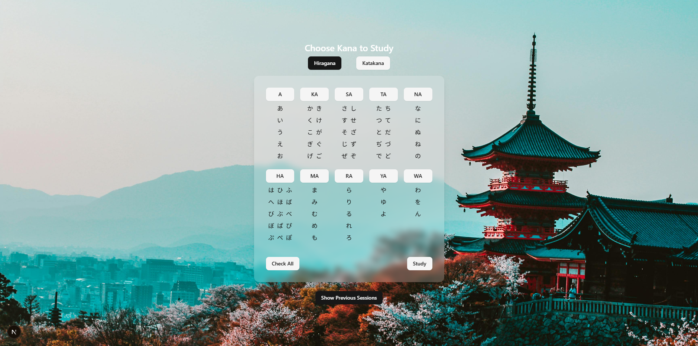

# Kana Typer 🈂️

A fun and efficient typing game to help you learn and master **Japanese Kana** – both **Hiragana** and **Katakana**!

🔗 **Live Demo**: [kana-typer-two.vercel.app](https://kana-typer-two.vercel.app)

## 🚀 Features

- 🎮 Interactive typing game to test your Kana knowledge
- 🧠 Tracks your correct answers and score
- ⏱️ Timer-based challenge
- 🎧 Sound toggle for auditory feedback
- 🎨 Clean UI powered by Tailwind CSS and shadcn/ui

## 📸 Preview




## 🛠️ Tech Stack

- [Next.js 15 (App Router)](https://nextjs.org)
- [TypeScript](https://www.typescriptlang.org/)
- [Tailwind CSS](https://tailwindcss.com/) + [shadcn/ui](https://ui.shadcn.com/)
- [Motion One](https://motion.dev/) for animations
- [Lucide Icons](https://lucide.dev/)

## 📦 Installation

Make sure you have **Node.js v18+** installed.

1. **Clone the repo**:

   ```bash
   git clone https://github.com/reddevotion/kana-typer.git
   cd kana-typer

   ```

2. **Install dependencies**:

   ```bash
   npm install

   ```

3. **Run the development server**:

   ```bash
   npm run dev
   ```

4. **Run the development server**:

   Open http://localhost:3000 to see the app in action.
